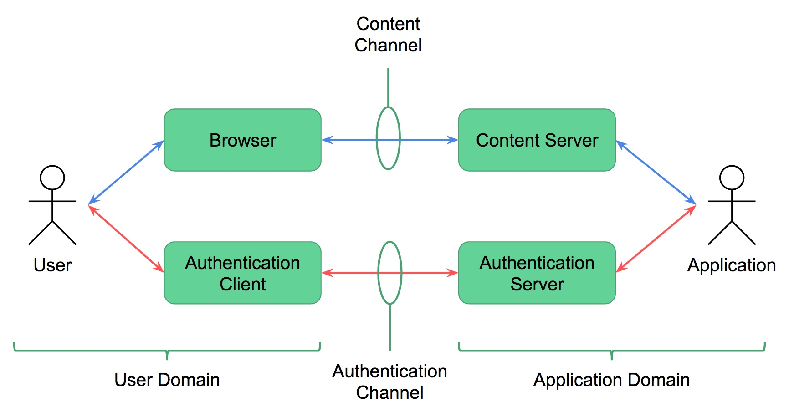
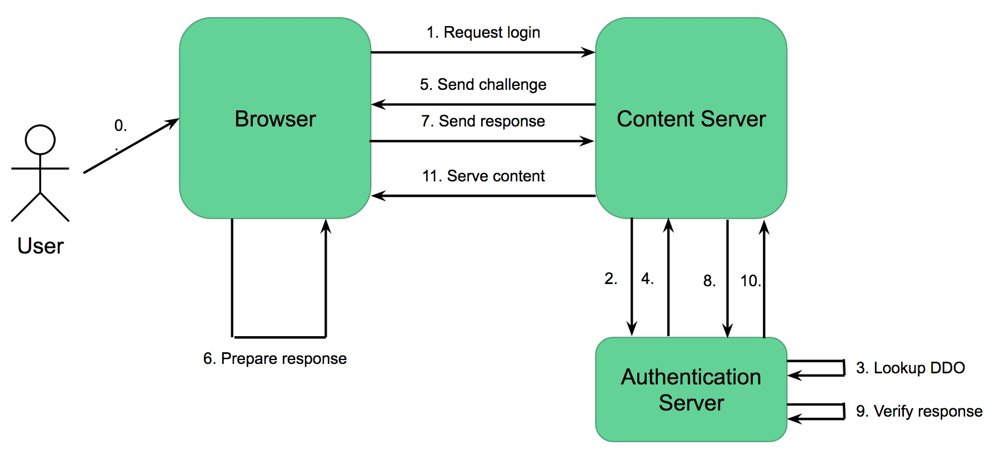
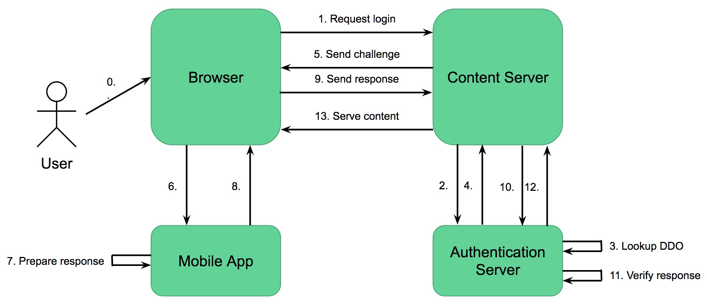
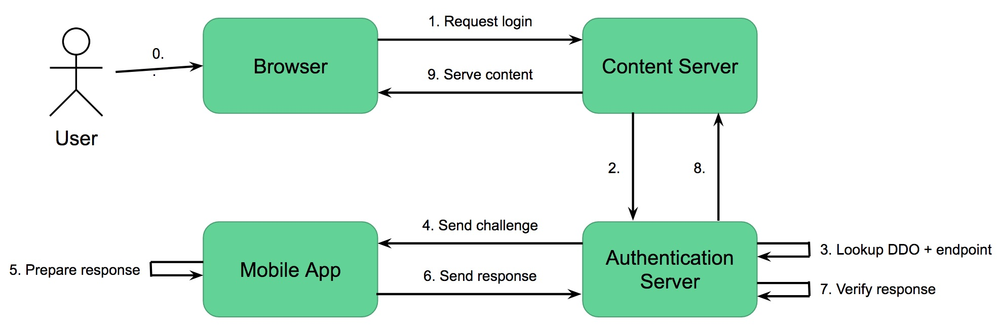

# Introduction

Here's how you authenticate between a client and server by proving control over a DID.

# Terminology

* Authentication Client - the means by which a user responds to an authentication challenge
* Content Server - the protected resource the user is seeking to access
* Challenge Endpoint - the means by which an authentication challenge is delivered to the user (typically a URI stored in DDO)

# Use Cases

Scenario | Logging in with | Authentication Client | Challenge Channel | Notes
1 | web browser | same browser | same browser | The user is accessing some content with a web browser, and authenticating themselves using the same browser
2 | web browser | mobile browser | mobile browser | The user is accessing some content with a web browser (most likely a laptop or tablet), and authenticating themselves using a browser on a separate device (most likely their mobile phone) - orchestrating that is the user's responsibility
3 | web browser | mobile app | mobile app | The user is accessing some content with a web browser, and is authenticating themselves using an app on their mobile device - orchestrating that is the user's responsibility
4 | mobile app | mobile app | mobile app | The user is accessing some content with an app, and is authenticating themselves using a different app - orchestrated via inter-app messaging
5 | web browser | same browser | Challenge Endpoint (in DDO) | Not sure what this one is?
6 | mobile app | Challenge Endpoint | Challenge Endpoint (in DDO) | The user is accessing some content with a web browser, and is authenticating themselves using a client (probably a mobile app) which is connected to the Challenge Endpoint

## Flow 1

## Flow 3

Orchestration (steps 6 & 8) may involve scanning a QR code, communication via Bluetooth, etc.

## Flow 6

This assumes the Content Server is already aware of the DID (or it is communicated in step 1).

# Requirements

* MUST be able to cryptographically prove control over a DID
   * Need to support multiple DID methods (the method specs should contain enough detail to determine which key proves control, and which signature scheme is appropriate)
* MUST be able to use a web browser with no extensions to authenticate
* MUST be able to use an app to authenticate
* MUST be able to use a secondary device to authenticate a session on your primary device

# Payload Example

These are payload requirements, to be augmented with examples:

## Challenge

* Will be a lightweight "verifiable claim request" payload
* Should be able to specify the DID (for returning users), although this is not required since the DID will be included in the response
* Should be able to specify the nonce to be signed, although this is not required since it is possible to deterministically generate nonces using a pre-agree scheme
  * Do we want to include explicit support for using timestamps?
* Should be able to request additional attributes to be included in the response claim (or do we want to avoid the drama of designing how that works?)
  * You might want a key to have been endorsed by a trusted party who certifies the user really has control (e.g. Yubikey)
* Should be able to include credentials (in the form of verifiable claims?) demonstrating the credibility of the Content Server which is requesting authentication
* May specify a particular public key?
   * the user may have several keys associated with a DID, and they are proving control of a DID not a specific key, so we will _not_ set the expectation that the user must use the same key each time
   * if the user responds using a different key than the one the content server requests (they may choose to, or they may have to because they have rotated keys), the content server may perform further authentication (for example, requesting another factor)
* Must be able to deliver the challenge in-band (direct to the user's browser) and out-of-band (to the service endpoint specified by the DDO)
* Must include the endpoint where the response should be sent

## Response

* Will be a verifiable claim
  * Must contain the DID
  * May contain other attributes requested (although clients can elect not to provide these)
* Signature uses a scheme appropriate to the DID?
  * Signature includes the nonce

# Protocol Diagrams

# Notes & Further Issues

* Need to show the enrolment/registration flow as well as the login/authentication flow
* How to detect the context (is this an in-band or out-of-band authentication)?
* How to support multi-device orchestration (specify a QR code scheme as a minimum)?
* What level of alignment is needed with DID Service Discovery (for now can we agree on a well-known URI scheme to use for sending challenges)?
* Need to be explicit about alignment to other standards
  * Web auth / FIDO
  * uPort uses JWT - challenge & claim live in the payload
* Need to account for delays in the protocol (poor connectivity, need for MFA, etc)
* **Need to reconcile with mutual authentication flows (where establishing a connection is required)**
* Need to call out the privacy implications of using timestamps for nonces

## Driving Adoption

* "DID Auth" is a terrible name for marketing purposes - consumers will never go for it
  * "Super Sign-On" is nice
  * Do we need a logo, trust mark, UX guidelines to drive adoption?
  * Use a trademark to drive conformance (avoid OpenID "issues")
* Want to avoid "NASCAR syndrome" with login buttons
  * Can the Content Server be aware of the authentication methods available to the user so it can display appropriate options? This has privacy implications.
