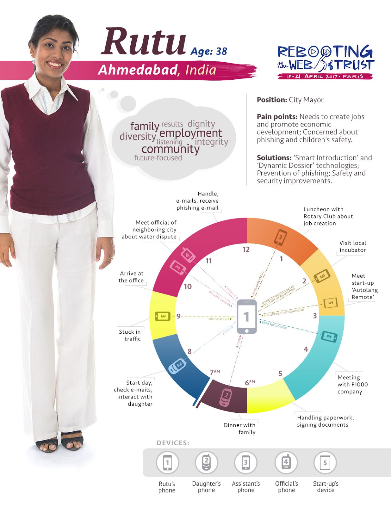

# Re-Imagining What Users Really Want

### A paper of the Rebooting the Web of Trust workshop, Paris, 2017

#### By Joe Andrieu &lt;joe@legendaryrequirements.com&gt;, Frederic Engel &lt;market.engel@gmail.com&gt;, Adam Lake &lt;creatinglake@gmail.com&gt;, Moses Ma &lt;moses.ma@futurelabconsulting.com&gt;, Olivier Maas &lt;olivier.maas@worldline.com&gt;, Mark van der Waal &lt;mark.vanderwaal@sovalacc.com&gt;

We consider five fictional personas to explore the obstacles and
opportunities for self-sovereign identity. For one, Rutu Shah, we
describe an illustrative day in her life.

Five Personas, Five Opportunities
=================================

The following five individuals represent a diverse sampling of normal,
everyday people whose lives could be improved by self-sovereign
identity. Today, these five aren’t using enhanced digital identity. For
each, we describe their current lack of engagement and provide at least
one opportunity that could reframe self-sovereign identity as a clear
win for them.

Renée Moreau
------------

Mme. Renée Moreau is a seventy-eight-year-old grandmother living in the
town of Amiens, France[^1]. She has a low level of understanding about
information technology, but fears being hacked and losing what meager
savings she has left. To the extent that she has discussed it with her
children, Renée Moreau feels “fancy” identity solutions are just too
complicated for her to use.

Reframing: **FamilyPix** secure picture sharing enables Renee to receive
photos of her grandchildren without exposing them to pedophiles or
marketers.

Bonus Reframing: A friends-of-family web of trust enables support when
emergencies arise. Family-of-friends and friends-of-family are
discretely recruited for real-time on-demand response to minor
emergencies and quality-of-life interactions such as getting locked out
of the house, trip-and-fall incidents, and needing a ride to a doctor
visit.

Jack Smith
----------

Mr. Jack Smith is the fifty-seven-year-old Chief Information Officer of
a Fortune 1000 company in the United States. He lives in Portland,
Oregon with his wife and ten-year-old son. He has earned a reputation as
a shrewd debunker of silver bullet initiatives that promise miracle
results but rarely deliver. As a rule, he has found identity solutions
too burdensome for integrated deployment throughout the hundreds of
applications deployed across his company. Instead, core corporate
applications are managed through a centralized Active Directory service
and departmental applications are free to implement their own identity
approach. He underestimates his company risk for regulatory compliance
and tends to avoid technical topics where his aging expertise might
appear dated. Employees spend as much as 15 minutes per day dealing
with logins at both intranet and Internet sites. Phishing is a
significant, but overlooked security risk.

Reframing: **Super Sign-On** brings corporate identity data into
compliance while unifying secure logins for applications across the
enterprise and beyond the corporate boundary at online services like
Trello, Atlassian (Jira, Confluence, etc), and Dropbox.

Mayumi Takamasa
---------------

Miss Mayumi Takamasa is a seventeen-year-old female student in Tokyo,
Japan. In conversations about privacy risks, she is dismissive and
doesn’t care about advanced identity management. Online she has seen
cyberbullying among her peers and goes to some effort to create
boundaries between what she and her friends post for each other and what
her mother can see.

Reframing: The **MySociety** social game creates independent identity across
social network platforms — without exposing content to uninvited eyes.
The game creates pseudonymous social spaces with built-in privacy,
disappearing messages, and points, levels, and badges based on social
interactions.

Joram Hadad
-----------

Mr. Joram Hadad is a twenty-five-year-old Syrian refugee from Damascus,
traveling through Greece on his way to resettlement in France. He fears
reprisal against his family should the Syrian government discover he
made it out of the country. He has no technology to speak of and has
provided authorities with a fake name. He needs health care and basic
human services.

Reframing: **MyID**, a biometric-and-PIN-secured digital datastore in a
USB thumb drive, gives Joram physical control over identity data that
only he has the power to share.

Rutu Shah
---------

Ms. Rutu Shah is a thirty-eight-year-old Mayor of a modest city in
India, Ahmedabad[^2]. In her daily life she is wary of phishing attacks
and security risks, but social and economic issues have taken priority
over pushing for better identity across city services. She understands
the value, but struggles to push for change, as commitments to
drinkable water, better education, and sustainable jobs got her elected.
She is particularly concerned about online predators and children’s
safety.

Reframing: **SafetyNet** creates personalized peer-to-peer, independent
trust networks where parents, educators, mentors, and social workers vet
and connect trusted resources for children. The same service also allows
professional networks to flourish through phish-proof, trusted
introductions, connecting entrepreneurs with business development,
mentors, and funding sources.

The Magic of Reframing
======================

Reframing is a powerful tool, based on the work of George Lakoff[^3],
linguist, former Distinguished Professor of Cognitive Science and
Linguistics at the University of California at Berkeley, and current
Director of the Center for the Neural Mind & Society[^4]. We use it here
to avoid the common pitfall of point-by-point refutation of obstacles
and misconceptions, to instead discover a transformative, indisputable
win for individuals from self-sovereign identity systems.

The process of reframing is based on finding blind spots. When you
detect blind spots, either in the user or in the self, you unveil the
potential for flipping the system. Useful techniques include
ethnography, empathy, design-thinking and design sprints. Rather than
fighting existing references, create a new one, framed indisputably in
terms of something individuals clearly want. Eschew obscure technical
jargon for emotionally impactful and concise trigger phrases that
immediately resonate. When you illuminate a blind spot with emotionally
desirable terminology, listeners naturally align their mental model and
find it hard to challenge the excitement and possibility. By focusing on
a single win for each individual, we further simplify the message and
focus positive resonance. Reframing greatly increases the possibility
for substantive engagement and adoption.

A Day in the Life of Rutu Shah
==============================

A fictional persona, Ms. Rutu Shah is the mayor of a modest city,
Ahmedabad, India[^5]. Here we envision a day in her live, enhanced by
self-sovereign identity. 

[^1]: [*https://en.wikipedia.org/wiki/Amiens*](https://en.wikipedia.org/wiki/Amiens)

[^2]: http://en.wikipedia.org/wiki/Ahmedabad

[^3]: [*https://georgelakoff.com/*](https://georgelakoff.com/)

[^4]: [*http://cnms.berkeley.edu*](http://cnms.berkeley.edu)/

[^5]: [*https://en.wikipedia.org/wiki/Ahmedabad*](https://en.wikipedia.org/wiki/Ahmedabad)
